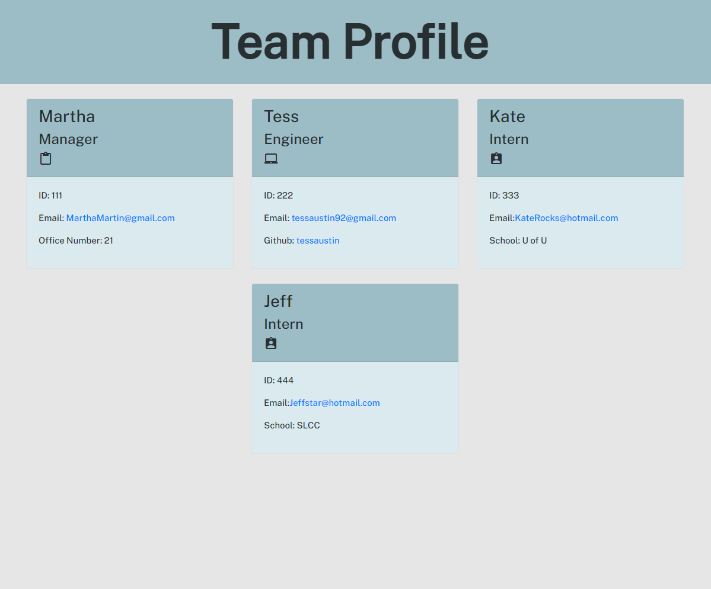

# Pro Rockin Team

## Description:
User can enter information about different employees to build a team profile. A html file is generated displaying each team member in a card with their name, role, ID, email and any other specific information to their role

## Licensing:

## Table of Contents 
* [Description](#description)
* [Installation](#installation)
* [Usage](#usage)
* [Contribution](#contribute)
* [Testing](#tests)
* [Questions](#questions)

## Installation:
- Dowload the repo 
- Inquirer package
- Jest package
- npm install

## Usage:
- Run 'node index' in the command line
- Follow the prompts to add team members and their information 
- When you are finished a html file will be created to open in a web browser 
- Walkthrough video : https://drive.google.com/file/d/1hnPl1NzI_2UQP9ECso9dcQFmYUHpMeCG/view

## License:
isc

## Contribution:
No contributions please

## Testing:
Run 'npm run test' from the command line

## Questions:
Please reach me through my Github account or my email with any additional questions.
- Github: [tessaustin](https://github.com/tessaustin)
- Email: tessaustin92@gmail.com 

## Screenshot:

